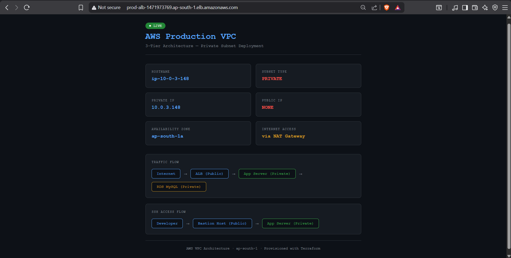

# 🌐 AWS VPC Architecture

> Production-grade 3-tier VPC architecture on AWS — public and private subnets across 2 Availability Zones, with NAT Gateway, Bastion Host, ALB, and RDS MySQL. All provisioned as code with Terraform.

---

## 🏗️ Architecture

```
                          🌐 Internet
                               │
                               ▼
                    ┌─────────────────────┐
                    │   Internet Gateway   │
                    └──────────┬──────────┘
                               │
          ┌────────────────────▼────────────────────┐
          │           VPC — 10.0.0.0/16             │
          │                                          │
          │  ┌─────────────────────────────────┐    │
          │  │     PUBLIC SUBNETS               │    │
          │  │                                  │    │
          │  │  ap-south-1a (10.0.1.0/24)      │    │
          │  │  ├── ALB (Load Balancer)         │    │
          │  │  ├── NAT Gateway                 │    │
          │  │  └── Bastion Host                │    │
          │  │                                  │    │
          │  │  ap-south-1b (10.0.2.0/24)      │    │
          │  │  └── ALB (Secondary AZ)          │    │
          │  └──────────────┬──────────────────┘    │
          │                 │ ALB routes here        │
          │  ┌──────────────▼──────────────────┐    │
          │  │     PRIVATE SUBNETS              │    │
          │  │                                  │    │
          │  │  ap-south-1a (10.0.3.0/24)      │    │
          │  │  └── App Server (Nginx)          │    │
          │  │      No Public IP ❌             │    │
          │  │      NAT for outbound ✅         │    │
          │  │                                  │    │
          │  │  ap-south-1b (10.0.4.0/24)      │    │
          │  │  └── RDS MySQL                   │    │
          │  │      Port 3306 Private Only ❌   │    │
          │  └─────────────────────────────────┘    │
          └──────────────────────────────────────────┘
```

---

## 🚀 Tech Stack

| Layer | Technology |
|---|---|
| **Infrastructure** | Terraform |
| **Network** | AWS VPC, Public/Private Subnets, IGW, NAT Gateway |
| **Compute** | AWS EC2 t3.micro (Bastion + App Server) |
| **Database** | AWS RDS MySQL 8.0 (db.t3.micro) |
| **Load Balancer** | AWS Application Load Balancer |
| **Web Server** | Nginx |
| **OS** | Ubuntu 22.04 LTS |
| **Region** | ap-south-1 (Mumbai) |

---

## 🔐 Security Design

| Component | Subnet | Public IP | Accessible From |
|---|---|---|---|
| ALB | Public | ✅ Yes | Internet (port 80) |
| Bastion Host | Public | ✅ Yes | Internet (port 22) |
| App Server | Private | ❌ None | ALB (port 80) + Bastion (port 22) |
| RDS MySQL | Private | ❌ None | App Server only (port 3306) |
| NAT Gateway | Public | ✅ Yes | Private subnets (outbound only) |

### Security Groups (Layer by Layer)
```
Internet → ALB SG (port 80 open)
ALB SG → App SG (port 80 only from ALB)
Bastion SG → App SG (port 22 only from Bastion)
App SG → RDS SG (port 3306 only from App)
```

---

## 🌐 Live Architecture Diagram



---

## 🔑 Bastion Host — SSH Jump

The app server has no public IP — only reachable via Bastion:

```bash
# Step 1: Connect to Bastion (public subnet)
ssh -A -i lup21.pem ubuntu@BASTION_PUBLIC_IP

# Step 2: Jump to App Server (private subnet)
ssh ubuntu@10.0.3.148

# You're now inside a private EC2 with no public IP!
```

---

## 🛠️ Infrastructure (Terraform)

```bash
cd terraform
terraform init
terraform plan
terraform apply    # provisions everything (~5 mins for RDS)
terraform destroy  # tears down everything
```

**Resources provisioned (26 total):**
- VPC (10.0.0.0/16)
- 2 Public Subnets (ap-south-1a, ap-south-1b)
- 2 Private Subnets (ap-south-1a, ap-south-1b)
- Internet Gateway
- NAT Gateway + Elastic IP
- Public Route Table → Internet Gateway
- Private Route Table → NAT Gateway
- 4 Security Groups (ALB, Bastion, App, RDS)
- Bastion Host EC2 (public subnet)
- App Server EC2 (private subnet)
- RDS MySQL db.t3.micro (private subnet)
- DB Subnet Group
- ALB + Target Group + Listener
- Target Group Attachment

---

## 📁 Project Structure

```
aws-vpc-architecture/
├── terraform/
│   └── main.tf     # Complete VPC infrastructure
├── assets/
│   └── vpc-diagram.png
└── README.md
```

---

## ⚙️ Setup

### Prerequisites
- AWS CLI configured
- Terraform installed
- SSH key pair in AWS

### Deploy
```bash
# 1. Clone
git clone https://github.com/Sumeet-Y1/aws-vpc-architecture

# 2. Provision
cd terraform && terraform apply

# 3. SSH into private EC2 via Bastion
ssh -A -i your-key.pem ubuntu@BASTION_IP
ssh ubuntu@PRIVATE_EC2_IP

# 4. Hit ALB URL in browser
http://ALB_DNS_NAME
```

### Destroy
```bash
cd terraform && terraform destroy
```

---

## 👤 Author

**Sumeet** — [GitHub](https://github.com/Sumeet-Y1)